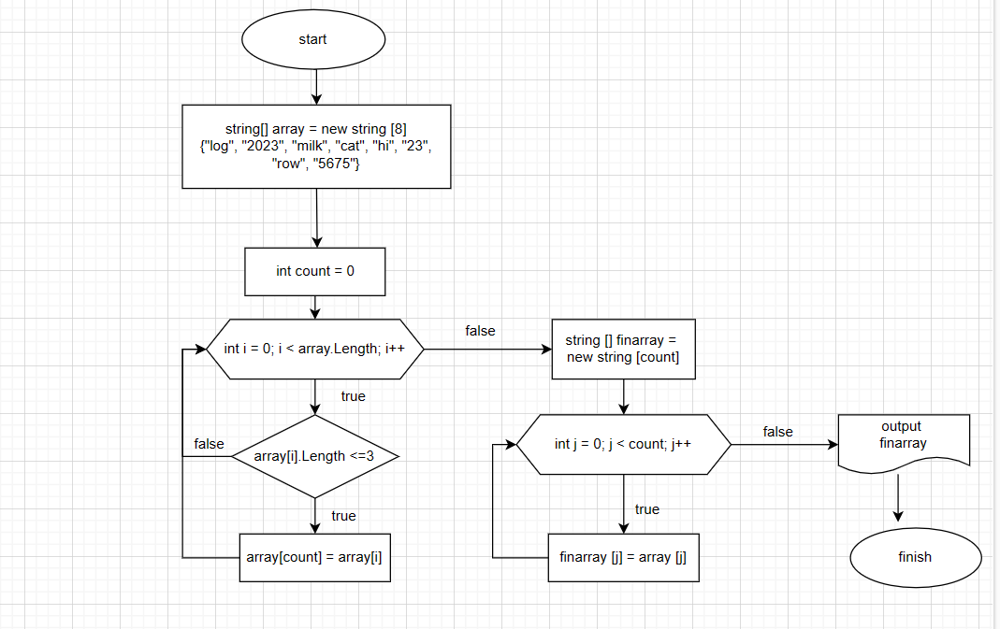

# Итоговая проверочная работа

*Данная работа была выполнена для проверки знаний и навыков по итогу прохождения первого блока обучения на программе Разработчик*

## Задача
Написать программу, которая из имеющегося массива строк формирует новый массив из строк, длина которых меньше, либо равна 3 символам. Первоначальный массив можно ввести с клавиатуры, либо задать на старте выполнения алгоритма. При решении не рекомендуется пользоваться коллекциями, лучше обойтись исключительно массивами.

## Алгоритм выполнения контрольной работы

1. **Создание репозитория на портале [GitHub](https://desktop.github.com/)**
2. **Создание блок-схемы с описанием алгоритма решения задачи на оналйн-сервисе [diagrams.net](https://www.diagrams.net/)**

>**__Блок-схема__**

3. **Формирование файла README.md с описанием решения:**
* задать  первоначальный массив на старте написания программы;
* проверить каждый элемент массива согласно условию: _меньше или равен 3м символам_ ;
* записать элемент, удовлетворяющий условию, в новый массив строк, присвоить индекс по-порядку;
* вывести искомый массив строк.
4. **Написание программы для решения задачи**

>*Описание программы:*

На старте программы задан массив из 8 элементов формата _string_. Далее сформирован метод **CompleteNewArray**, который на вход принимает исходный массив, а возвращает искомый массив с элементами, удовлетворяющими условию. Внутри метода проверяется каждый элемент первоначального массива согласно условию, и заполняется новый массив.
В конце программы в консоль выводится искомый массив.

